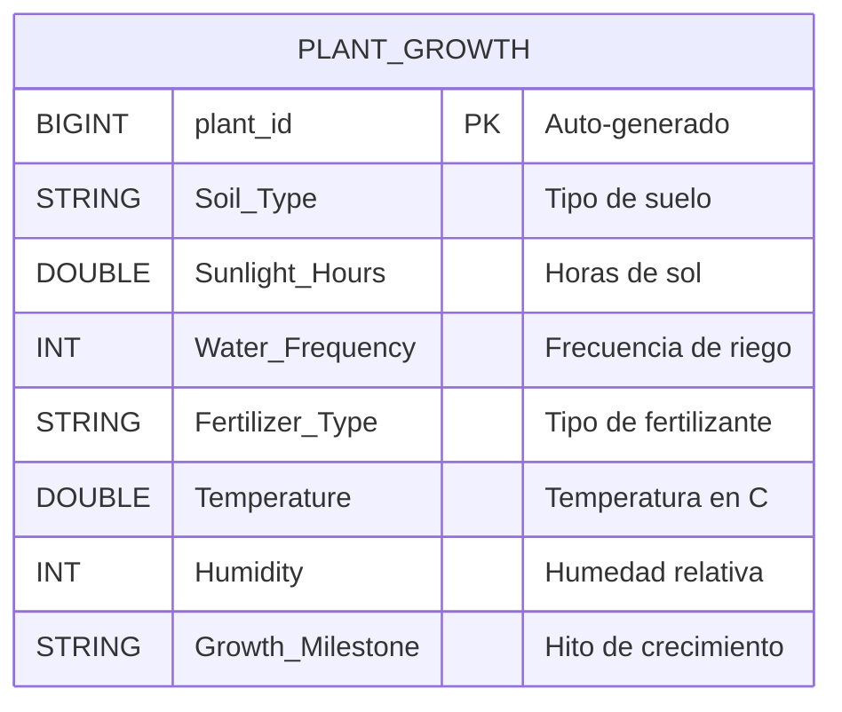

# 🌱 Actividad 2 — Procesamiento de Datos en Infraestructura Cloud

<div align="center">


**Unidad 3 · Evidencia de Aprendizaje (EA3)**

*Taller de procesamiento de datos desplegado sobre Databricks Community Edition*

</div>

---

## 👤 Autor

| Campo | Detalle |
|:---|:---|
| **Nombre** | Alejandro Arango Calderón |
| **Actividad** | EA3 — Taller procesamiento de datos en infraestructura cloud |
| **Plataforma** | Databricks Community Edition |
| **Fecha** | Junio 2026 |

---

## 📖 Descripción

Este proyecto implementa un pipeline completo de procesamiento de datos en la nube utilizando **Databricks Community Edition**. Se trabaja con el dataset [**Plant Growth Data — Classification**](https://www.kaggle.com/datasets/gorororororo23/plant-growth-data-classification) de Kaggle, que contiene 1,000 registros de condiciones ambientales de plantas y sus hitos de crecimiento.

El notebook demuestra el ciclo completo: desde el **diseño del esquema** hasta las **validaciones con Spark y SQL**, incluyendo una comparativa técnica entre ambos enfoques.

---

## 📂 Estructura del Repositorio

```
📦 Arango_Calderon_Alejandro_Actividad_2
 ├── 📓 Arango_Calderon_Alejandro_Actividad_2.ipynb   ← Notebook principal
 ├── 📊 plant_growth_data.csv                          ← Dataset (1,000 registros)
 └── 📄 README.md                                      ← Este archivo
```

---

## 📋 Contenido del Notebook

| Sección | Descripción | Puntos |
|:---|:---|:---:|
| **0. Diseño del Esquema** | StructType (PySpark), DDL (Spark SQL), diccionario de datos y diagrama ER en Mermaid | 20 pts |
| **1. Configuración Databricks CE** | Versiones de Spark/Python, configuración del clúster, estructura DBFS | 20 pts |
| **2. Ingesta desde Kaggle** | Carga del CSV, lectura con esquema, creación de tabla Delta, validación | 15 pts |
| **3. Validaciones Spark & SQL** | 8 validaciones paralelas: metadatos, describe, GROUP BY, COUNT, filtros | 15 pts |
| **4. SQL vs Spark** | Tabla comparativa de 8 criterios con ventajas y desventajas | 15 pts |

---

## 🗂️ Dataset

**Plant Growth Data — Classification**

| Campo | Tipo | Descripción |
|:---|:---:|:---|
| `Soil_Type` | STRING | Tipo de suelo (loam, sandy, clay, silt, peaty, chalky) |
| `Sunlight_Hours` | DOUBLE | Horas de exposición solar diaria |
| `Water_Frequency` | INT | Frecuencia de riego (veces por semana) |
| `Fertilizer_Type` | STRING | Tipo de fertilizante (chemical, organic, none) |
| `Temperature` | DOUBLE | Temperatura ambiente en °C |
| `Humidity` | INT | Humedad relativa del ambiente (%) |
| `Growth_Milestone` | STRING | Hito de crecimiento (Early Growth, Vegetative, Flowering, Fruiting) |



---

## 🛠️ Tecnologías Utilizadas

<table>
<tr>
<td align="center" width="150">

**Apache Spark**<br>Motor de procesamiento distribuido

</td>
<td align="center" width="150">

**PySpark**<br>API de DataFrames en Python

</td>
<td align="center" width="150">

**Spark SQL**<br>Consultas declarativas SQL

</td>
<td align="center" width="150">

**Delta Lake**<br>Formato de tabla ACID

</td>
<td align="center" width="150">

**Databricks CE**<br>Plataforma cloud gratuita

</td>
</tr>
</table>

---

## 🚀 Cómo Ejecutar

1. **Crear cuenta** en [Databricks Community Edition](https://community.cloud.databricks.com)
2. **Crear un clúster** (Compute → Create Cluster)
3. **Subir el CSV** a DBFS:
   - Data → Create Table → Upload `plant_growth_data.csv`
   - Ruta: `/FileStore/tables/plant_growth_data.csv`
4. **Importar el notebook**:
   - Workspace → Import → seleccionar `Arango_Calderon_Alejandro_Actividad_2.ipynb`
5. **Conectar el clúster** y ejecutar con `Run All`

---

## 📊 Validaciones Realizadas

| Validación | PySpark | SQL | Consistente |
|:---|:---|:---|:---:|
| Metadatos | `printSchema()` | `DESCRIBE TABLE` | ✅ |
| Estadísticos | `df.describe()` | `AVG, MIN, MAX, STDDEV` | ✅ |
| Agrupación por suelo | `groupBy().agg()` | `GROUP BY ... ORDER BY` | ✅ |
| Agrupación por crecimiento | `groupBy().agg()` | `GROUP BY ... ORDER BY` | ✅ |
| Conteos | `df.count()` | `SELECT COUNT(*)` | ✅ |
| Muestras | `df.limit(5)` | `LIMIT 5` | ✅ |
| Filtros | `df.filter()` | `WHERE ... AND ...` | ✅ |
| Multi-agrupación | `groupBy(col1, col2)` | `GROUP BY col1, col2` | ✅ |

---

## ⚖️ SQL vs Spark — Resumen

| | SQL | PySpark |
|:---|:---:|:---:|
| Facilidad de uso | ✅ | ⚠️ |
| Integración con BI | ✅ | ⚠️ |
| Pipelines ETL complejos | ⚠️ | ✅ |
| UDFs y extensibilidad | ⚠️ | ✅ |
| Control de rendimiento | ⚠️ | ✅ |
| Depuración | ⚠️ | ✅ |

> **Conclusión:** Ambos enfoques son complementarios. SQL es ideal para exploración rápida; PySpark para pipelines complejos y control fino.

---

<div align="center">

**Desarrollado para la materia de Procesamiento de Datos en Infraestructura Cloud**

📓 Notebook · 📊 Dataset · 🔥 Spark · ☁️ Databricks

</div>
